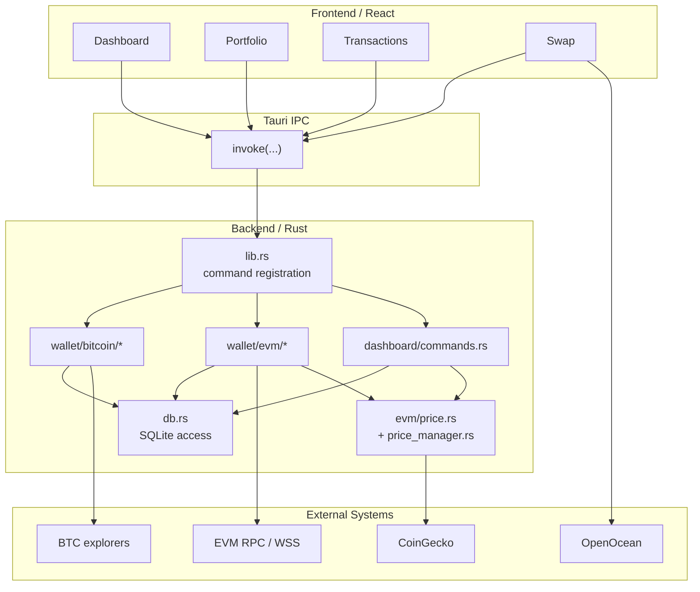

# Current Architecture

## Purpose

This appendix documents the current runtime architecture by code module.

## Codebase Module Map

The current application is organized around a small number of concrete runtime domains.

### Frontend

- `src/App.tsx`
  Registers the main application routes.
- `src/pages/Dashboard/*`
  Dashboard stats, allocation, history, and recent transaction presentation.
- `src/pages/Portfolio/components/BitcoinAssets.tsx`
  Bitcoin wallet list, refresh, create/import, export, and send flows.
- `src/pages/Portfolio/components/EvmAssets.tsx`
  EVM wallet list, balance refresh, asset display, and send flows.
- `src/pages/Transactions/index.tsx`
  Transaction history display.
- `src/pages/Swap/*`
  Swap UI, quotes, allowances, gas estimation, and send flow coordination.

### Backend

- `src-tauri/src/lib.rs`
  Tauri bootstrap and command registration.
- `src-tauri/src/db.rs`
  SQLite schema and persistence operations.
- `src-tauri/src/dashboard/commands.rs`
  Local portfolio aggregation and dashboard read operations.
- `src-tauri/src/wallet/bitcoin/*`
  Bitcoin wallet creation, private-key handling, balance lookup, and transaction sending/history.
- `src-tauri/src/wallet/evm/*`
  EVM wallet creation, multichain balance lookup, price cache, RPC provider handling, and transaction sending/history.

### External Services

- Bitcoin explorer APIs
- EVM RPC and optional WSS providers
- CoinGecko for pricing
- OpenOcean for swap quote, gas, and allowance support

## Current Runtime Topology

The current runtime is a local-first desktop application where React talks to Rust through Tauri IPC. Most durable state is persisted in local SQLite.

## Current Data Flow

The current system uses separate flows for wallet state, pricing, portfolio aggregation, and swaps.

### Bitcoin Balance Flow

1. Frontend requests wallet list through `bitcoin_get_wallets`.
2. A specific wallet is refreshed through `bitcoin_get_wallet_with_balance`.
3. Rust reads wallet metadata from SQLite.
4. Rust queries external explorer APIs for the address balance.
5. Rust updates `bitcoin_wallets.balance` in SQLite.
6. Frontend updates local UI state.

### EVM Balance Flow

1. Frontend requests wallet list through `evm_get_wallets`.
2. Each wallet is refreshed through `evm_get_wallet_with_balances`.
3. Rust loads the configured chains and tracked assets.
4. Rust queries native balances and token balances by chain.
5. Rust reads cached prices from the EVM price manager.
6. Rust writes refreshed asset balances and USD values into `evm_asset_balances`.
7. Frontend updates local UI state for the wallet.

### Dashboard Flow

1. Frontend reads cached dashboard stats from SQLite through `get_dashboard_stats`.
2. Frontend separately reads portfolio history and allocation.
3. Frontend then triggers `refresh_dashboard_stats`.
4. Rust recomputes dashboard numbers using:
   - cached wallet balances from SQLite
   - cached token asset rows from SQLite
   - cached prices from the price manager
5. Rust writes fresh dashboard aggregates and portfolio snapshots into SQLite and returns `DashboardStats` with freshness metadata.
6. Frontend re-reads history and allocation after refresh, but it no longer recomputes totals locally.

### Swap Flow

1. Frontend requests quotes, gas, and allowance data directly from OpenOcean.
2. Frontend uses Tauri commands only for wallet-side transaction actions such as approval or sending.

## Existing Tauri Commands By Domain

### Bitcoin Wallet Domain

- `bitcoin_create_mnemonic`
- `bitcoin_import_mnemonic`
- `bitcoin_create_wallet_from_mnemonic`
- `bitcoin_create_wallet_from_private_key`
- `bitcoin_export_mnemonic`
- `bitcoin_export_private_key`
- `bitcoin_get_wallets`
- `bitcoin_get_wallet`
- `bitcoin_get_wallet_with_balance`
- `bitcoin_delete_wallet`

### EVM Wallet Domain

- `evm_create_mnemonic`
- `evm_import_mnemonic`
- `evm_create_wallet_from_mnemonic`
- `evm_create_wallet_from_private_key`
- `evm_export_mnemonic`
- `evm_export_private_key`
- `evm_get_wallets`
- `evm_get_wallet`
- `evm_get_wallet_with_balances`
- `evm_delete_wallet`

### Transaction Domain

- `send_bitcoin`
- `bitcoin_estimate_fees`
- `get_bitcoin_transactions`
- `get_all_bitcoin_transactions`
- `fetch_bitcoin_history`
- `send_evm`
- `evm_estimate_gas`
- `get_evm_transactions`
- `get_all_evm_transactions`
- `fetch_evm_history`
- `evm_send_transaction`
- `evm_approve_token`

### Dashboard Domain

- `get_dashboard_stats`
- `refresh_dashboard_stats`
- `get_portfolio_history`
- `get_asset_allocation`
- `get_unified_recent_transactions`
- `get_bitcoin_price`

### State Domain

- `state_get_bitcoin_wallet_balance_state`
- `state_get_bitcoin_price_state`
- `state_get_bitcoin_portfolio_state`

### Security Domain

- `security_unlock`
- `security_lock`
- `security_is_unlocked`

## Current Database Responsibilities

The current SQLite schema mixes several responsibilities:

- wallet metadata
- secret storage
- EVM asset balance cache
- transaction history cache
- dashboard aggregate cache
- portfolio history snapshots

### Current Tables

- `bitcoin_wallets`
- `bitcoin_wallet_secrets`
- `evm_wallets`
- `evm_wallet_secrets`
- `evm_asset_balances`
- `bitcoin_transactions`
- `evm_transactions`
- `dashboard_stats`
- `portfolio_history`

### Current Observed Role Of SQLite

SQLite currently acts as:

- the durable local store for wallet metadata and secret material
- a read model for balances and transactions
- a cache for portfolio and dashboard aggregation

This role is powerful but currently under-specified. The current implementation does not yet clearly separate:

- canonical local state
- cached external state
- derived aggregate state

## Current External Dependencies

### Bitcoin

- Blockstream explorer APIs
- Blockchain.info explorer APIs

### EVM

- per-chain HTTP RPC
- optional WSS providers via the hybrid provider layer

### Pricing

- CoinGecko simple price endpoint
- in-process price cache with periodic refresh

### Swap

- OpenOcean quote, allowance, and gas APIs

## Current Refresh Model

The current refresh model is partially unified.

### What Is Centralized Today

- EVM token prices are periodically refreshed in the background by the price manager.
- dashboard refresh and history refresh routes use the sync engine
- BTC and EVM transaction lifecycle helpers share one six-state vocabulary

### What Is Still Not Centralized Today

- Bitcoin wallet balances refresh only on explicit wallet refresh or transaction-related actions.
- EVM wallet balances refresh on page load and explicit refresh.

This means the wallet has meaningful shared state semantics, but not yet one universal sync trigger owner for every wallet surface.

## Current State Feedback Problems

The current implementation is materially more explicit than the original wallet baseline, but a few state-feedback weaknesses remain.

### 1. Cached And Refreshed Truth Are Mixed

Dashboard data is intentionally loaded in two phases:

- cached values first
- refreshed values later

The dashboard now carries freshness metadata, but the application still exposes cached and refreshed truth through multiple read paths rather than one consolidated wallet-state facade.

### 2. State Contracts Differ By Surface

BTC state commands use frozen `BalanceState` / `PriceState` / `PortfolioState` contracts, while EVM wallet screens consume `EvmWalletBalancesResponse` with wallet- and chain-level freshness. The semantics are compatible, but the transport shape still varies.

### 3. Swap Market Data Sits Outside The Wallet Freshness Model

Wallet-owned state now surfaces freshness and partial failure, but OpenOcean quote and allowance flows are still frontend-owned and do not participate in the same contract.

### 4. SQLite Still Carries Mixed Categories Of State

SQLite stores durable local state, synchronized external state, and derived dashboard state together. ADR-0002 clarifies the semantics, but command surfaces still expose those categories through separate APIs.

## Mismatch Between Product Semantics And Implementation

The product surface already presents the application as a wallet, portfolio tracker, and swap client. The current implementation supports that at a feature level, but several architectural mismatches remain:

- it behaves like a wallet without a mature key-security boundary
- it behaves like a portfolio tracker without a unified freshness model
- it behaves like a transaction client without a consistent lifecycle model
- it behaves like a Web3-adjacent product without a Web3 interaction layer

This is why the current implementation is best described as an `asset wallet and portfolio application`, rather than a full Web3 wallet.

## File-To-Responsibility Mapping

### Frontend

- `src/App.tsx`
  Application route map.
- `src/pages/Dashboard/hooks/useDashboardData.ts`
  Dashboard loading and frontend consistency reconciliation.
- `src/pages/Portfolio/components/BitcoinAssets.tsx`
  Bitcoin wallet UI behavior.
- `src/pages/Portfolio/components/EvmAssets.tsx`
  EVM wallet UI behavior and refresh controls.
- `src/pages/Swap/hooks/useSwap.ts`
  Swap-side frontend orchestration.
- `src/pages/Swap/services/openocean.service.ts`
  Direct OpenOcean API integration from the frontend.

### Backend

- `src-tauri/src/lib.rs`
  Command registration and background price refresh bootstrap.
- `src-tauri/src/db.rs`
  SQLite schema and persistence behavior.
- `src-tauri/src/dashboard/commands.rs`
  Dashboard aggregation and local read model output.
- `src-tauri/src/wallet/bitcoin/commands.rs`
  Bitcoin wallet command surface.
- `src-tauri/src/wallet/bitcoin/balance.rs`
  Bitcoin balance reads via explorer APIs.
- `src-tauri/src/wallet/bitcoin/transaction.rs`
  Bitcoin transaction history and send handling.
- `src-tauri/src/wallet/evm/commands.rs`
  EVM wallet command surface.
- `src-tauri/src/wallet/evm/balance.rs`
  Multichain EVM balance refresh logic.
- `src-tauri/src/wallet/evm/transaction.rs`
  EVM transaction send and history handling.
- `src-tauri/src/wallet/evm/price.rs`
  Price fetching and symbol-to-source mapping.
- `src-tauri/src/wallet/evm/price_manager.rs`
  In-process background price cache.
