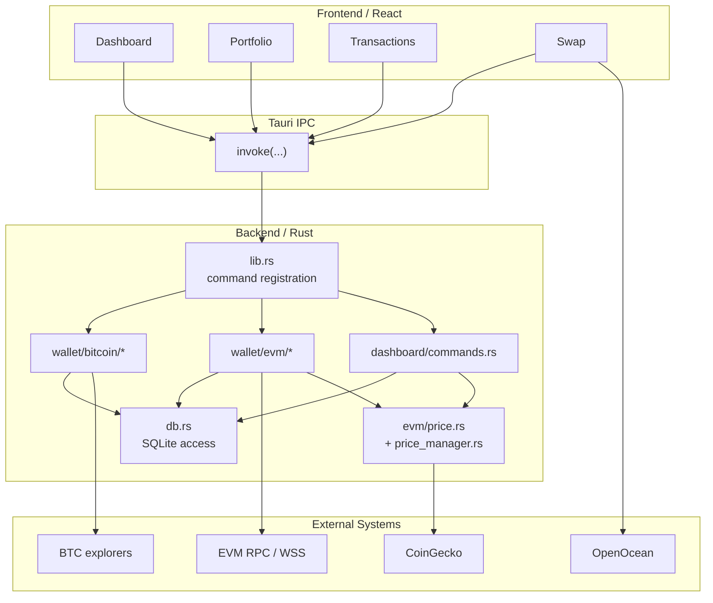

# Current Architecture

## Purpose

This appendix documents the current runtime architecture by code module.

## Codebase Module Map

The current application is organized around a small number of concrete runtime domains.

### Frontend

- `src/App.tsx`
  Registers the main application routes.
- `src/pages/Dashboard/*`
  Dashboard stats, allocation, history, and recent transaction presentation.
- `src/pages/Portfolio/components/BitcoinAssets.tsx`
  Bitcoin wallet list, refresh, create/import, export, and send flows.
- `src/pages/Portfolio/components/EvmAssets.tsx`
  EVM wallet list, balance refresh, asset display, and send flows.
- `src/pages/Transactions/index.tsx`
  Transaction history display.
- `src/pages/Swap/*`
  Swap UI, quotes, allowances, gas estimation, and send flow coordination.

### Backend

- `src-tauri/src/lib.rs`
  Tauri bootstrap and command registration.
- `src-tauri/src/db.rs`
  SQLite schema and persistence operations.
- `src-tauri/src/dashboard/commands.rs`
  Local portfolio aggregation and dashboard read operations.
- `src-tauri/src/wallet/bitcoin/*`
  Bitcoin wallet creation, private-key handling, balance lookup, and transaction sending/history.
- `src-tauri/src/wallet/evm/*`
  EVM wallet creation, multichain balance lookup, price cache, RPC provider handling, and transaction sending/history.

### External Services

- Bitcoin explorer APIs
- EVM RPC and optional WSS providers
- CoinGecko for pricing
- OpenOcean for swap quote, gas, and allowance support

## Current Runtime Topology

The current runtime is a local-first desktop application where React talks to Rust through Tauri IPC. Most durable state is persisted in local SQLite.

## Current Data Flow

The current system uses separate flows for wallet state, pricing, portfolio aggregation, and swaps.

### Bitcoin Balance Flow

1. Frontend requests wallet list through `bitcoin_get_wallets`.
2. A specific wallet is refreshed through `bitcoin_get_wallet_with_balance`.
3. Rust reads wallet metadata from SQLite.
4. Rust queries external explorer APIs for the address balance.
5. Rust updates `bitcoin_wallets.balance` in SQLite.
6. Frontend updates local UI state.

### EVM Balance Flow

1. Frontend requests wallet list through `evm_get_wallets`.
2. Each wallet is refreshed through `evm_get_wallet_with_balances`.
3. Rust loads the configured chains and tracked assets.
4. Rust queries native balances and token balances by chain.
5. Rust reads cached prices from the EVM price manager.
6. Rust writes refreshed asset balances and USD values into `evm_asset_balances`.
7. Frontend updates local UI state for the wallet.

### Dashboard Flow

1. Frontend reads cached dashboard stats from SQLite through `get_dashboard_stats`.
2. Frontend separately reads portfolio history and allocation.
3. Frontend then triggers `refresh_dashboard_stats`.
4. Rust recomputes dashboard numbers using:
   - cached wallet balances from SQLite
   - cached token asset rows from SQLite
   - cached prices from the price manager
5. Rust writes fresh dashboard aggregates and portfolio snapshots into SQLite.
6. Frontend re-reads history and allocation.

### Swap Flow

1. Frontend requests quotes, gas, and allowance data directly from OpenOcean.
2. Frontend uses Tauri commands only for wallet-side transaction actions such as approval or sending.

## Existing Tauri Commands By Domain

### Bitcoin Wallet Domain

- mnemonic creation and import
- wallet creation from mnemonic or private key
- mnemonic export
- private key export
- wallet list and wallet lookup
- wallet balance refresh
- wallet delete

### EVM Wallet Domain

- mnemonic creation and import
- wallet creation from mnemonic or private key
- mnemonic export
- private key export
- wallet list and wallet lookup
- multichain wallet balance refresh
- wallet delete

### Transaction Domain

- Bitcoin send and fee estimation
- Bitcoin transaction history fetch and query
- EVM send and gas estimation
- EVM transaction history fetch and query
- token approval
- raw EVM transaction support used by swap flows

### Dashboard Domain

- cached stats read
- dashboard refresh
- portfolio history read
- asset allocation read
- unified recent transaction read

## Current Database Responsibilities

The current SQLite schema mixes several responsibilities:

- wallet metadata
- secret storage
- EVM asset balance cache
- transaction history cache
- dashboard aggregate cache
- portfolio history snapshots

### Current Tables

- `bitcoin_wallets`
- `bitcoin_wallet_secrets`
- `evm_wallets`
- `evm_wallet_secrets`
- `evm_asset_balances`
- `bitcoin_transactions`
- `evm_transactions`
- `dashboard_stats`
- `portfolio_history`

### Current Observed Role Of SQLite

SQLite currently acts as:

- the durable local store for wallet metadata and secret material
- a read model for balances and transactions
- a cache for portfolio and dashboard aggregation

This role is powerful but currently under-specified. The current implementation does not yet clearly separate:

- canonical local state
- cached external state
- derived aggregate state

## Current External Dependencies

### Bitcoin

- Blockstream explorer APIs
- Blockchain.info explorer APIs

### EVM

- per-chain HTTP RPC
- optional WSS providers via the hybrid provider layer

### Pricing

- CoinGecko simple price endpoint
- in-process price cache with periodic refresh

### Swap

- OpenOcean quote, allowance, and gas APIs

## Current Refresh Model

The current refresh model is decentralized rather than unified.

### What Is Centralized Today

- EVM token prices are periodically refreshed in the background by the price manager.

### What Is Not Centralized Today

- Bitcoin wallet balances refresh only on explicit wallet refresh or transaction-related actions.
- EVM wallet balances refresh on page load and explicit refresh.
- Dashboard values refresh through a separate aggregation flow.
- Transaction state progression is not managed by a shared lifecycle updater.

This means the wallet currently has multiple refresh entry points, but not a single wallet sync engine.

## Current State Feedback Problems

The current implementation already shows several state-feedback weaknesses.

### 1. Cached And Refreshed Truth Are Mixed

Dashboard data is intentionally loaded in two phases:

- cached values first
- refreshed values later

But the user is not told which values are cached, which values are stale, and which values were recomputed in the background.

### 2. Frontend Re-derives Consistency

The dashboard frontend derives a synchronized total balance from allocation data, rather than treating backend state as a single explicit state model. This is a sign that consistency is inferred rather than modeled.

### 3. Price Failure Is Not Explicit

Bitcoin price lookup has a frontend fallback path that silently substitutes a reasonable default. This produces a usable UI, but not an explicit stale or unavailable state.

### 4. Transaction Status Semantics Are Not Unified

- Bitcoin sends are inserted as `pending`
- EVM sends are inserted as `confirmed`

This means transaction status today is not governed by one consistent lifecycle model.

### 5. No Freshness Metadata Is Surfaced

The UI does not yet consume a common model for:

- last refreshed time
- stale state
- partial failure
- failed sources

## Mismatch Between Product Semantics And Implementation

The product surface already presents the application as a wallet, portfolio tracker, and swap client. The current implementation supports that at a feature level, but several architectural mismatches remain:

- it behaves like a wallet without a mature key-security boundary
- it behaves like a portfolio tracker without a unified freshness model
- it behaves like a transaction client without a consistent lifecycle model
- it behaves like a Web3-adjacent product without a Web3 interaction layer

This is why the current implementation is best described as an `asset wallet and portfolio application`, rather than a full Web3 wallet.

## File-To-Responsibility Mapping

### Frontend

- `src/App.tsx`
  Application route map.
- `src/pages/Dashboard/hooks/useDashboardData.ts`
  Dashboard loading and frontend consistency reconciliation.
- `src/pages/Portfolio/components/BitcoinAssets.tsx`
  Bitcoin wallet UI behavior.
- `src/pages/Portfolio/components/EvmAssets.tsx`
  EVM wallet UI behavior and refresh controls.
- `src/pages/Swap/hooks/useSwap.ts`
  Swap-side frontend orchestration.
- `src/pages/Swap/services/openocean.service.ts`
  Direct OpenOcean API integration from the frontend.

### Backend

- `src-tauri/src/lib.rs`
  Command registration and background price refresh bootstrap.
- `src-tauri/src/db.rs`
  SQLite schema and persistence behavior.
- `src-tauri/src/dashboard/commands.rs`
  Dashboard aggregation and local read model output.
- `src-tauri/src/wallet/bitcoin/commands.rs`
  Bitcoin wallet command surface.
- `src-tauri/src/wallet/bitcoin/balance.rs`
  Bitcoin balance reads via explorer APIs.
- `src-tauri/src/wallet/bitcoin/transaction.rs`
  Bitcoin transaction history and send handling.
- `src-tauri/src/wallet/evm/commands.rs`
  EVM wallet command surface.
- `src-tauri/src/wallet/evm/balance.rs`
  Multichain EVM balance refresh logic.
- `src-tauri/src/wallet/evm/transaction.rs`
  EVM transaction send and history handling.
- `src-tauri/src/wallet/evm/price.rs`
  Price fetching and symbol-to-source mapping.
- `src-tauri/src/wallet/evm/price_manager.rs`
  In-process background price cache.
