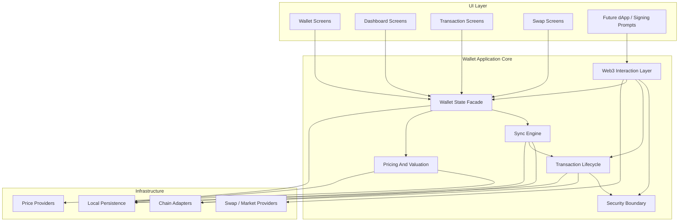
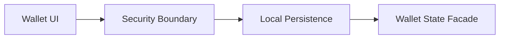
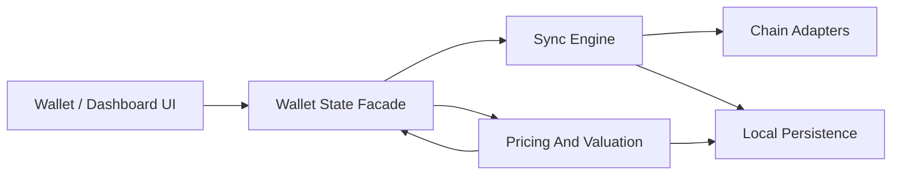
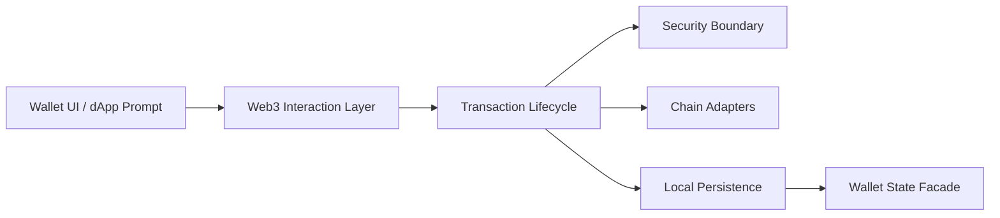

# Target Architecture

## Purpose

This appendix documents the intended target wallet architecture by system layer.

Its job is not to restate the current gaps. Its job is to show the target shape clearly enough that:

- implementation phases cannot drift into incompatible interpretations
- ADRs can be written against concrete subsystem boundaries
- future Web3 wallet capabilities have reserved extension seams

## Scope Note

This target architecture is defined in two horizons.

### Horizon A: Foundation-Complete Wallet

This is the target shape required to say the current local-first asset wallet has been structurally hardened.

It includes:

- security boundary
- wallet state model
- sync engine
- normalized transaction lifecycle
- explicit pricing and portfolio freshness

### Horizon B: Full Web3 Wallet Extension

This is the extension path layered on top of the foundation.

It includes:

- EIP-1193 provider behavior
- WalletConnect sessions
- typed-data signing
- approval scope review
- dApp permission boundaries

This appendix defines both, but treats Horizon A as the immediate implementation target.

## Target Subsystem Map

The target architecture is organized around nine subsystems.

### 1. UI Layer

Owns:

- wallet screens
- dashboard screens
- transaction screens
- swap screens
- future dApp prompts

Does not own:

- truth reconciliation
- signing decisions
- chain-specific state derivation

### 2. Wallet State Facade

Owns:

- the UI-facing wallet state contract
- balance freshness metadata
- price freshness metadata
- portfolio truth presentation
- lifecycle status presentation
- partial failure exposure

This is the layer the UI should read from instead of inferring consistency itself.

### 3. Sync Engine

Owns:

- refresh entry points
- sync reason tracking
- target-specific refresh orchestration
- receipt refresh
- history refresh coordination
- approval refresh coordination where supported

This is the system that turns scattered refresh logic into one shared runtime policy.

### 4. Transaction Lifecycle Layer

Owns:

- transaction build
- fee and gas estimation
- broadcast
- lifecycle state updates
- confirmation tracking
- replacement and drop handling

This layer provides one vocabulary for BTC and EVM transaction progress.

### 5. Security Boundary

Owns:

- secret storage abstraction
- unlock state
- export policy
- signing authority checks
- operation-level risk boundary

This layer is the only place allowed to translate persisted secret material into signing capability.

### 6. Chain Adapters

Owns:

- BTC explorer and transaction reads/writes
- EVM RPC and WSS-backed reads/writes
- normalized chain-facing balance and receipt calls

This layer hides chain-specific transport and provider details from the rest of the wallet.

### 7. Pricing And Valuation Layer

Owns:

- asset metadata
- price provider integration
- price freshness
- portfolio valuation
- dashboard aggregates
- portfolio snapshots

### 8. Local Persistence

Owns:

- durable local wallet metadata
- secret storage backing
- cached external state
- derived dashboard state
- sync metadata

This layer does not define business truth by itself. It stores the outputs of other subsystems.

### 9. Web3 Interaction Layer

Owns:

- future dApp session management
- account exposure policy
- chain exposure policy
- typed-data and message-signing request handling
- WalletConnect / EIP-1193 bridging

This layer is intentionally reserved even if not fully implemented yet.

## Target Runtime Topology

## Module Contracts

The target architecture only works if module boundaries are explicit. The following contracts should hold.

| Module | Input | Output | Must Not Do |
|---|---|---|---|
| UI Layer | Wallet-state view models | user actions, prompt decisions | derive truth heuristics |
| Wallet State Facade | sync results, valuation results, persisted state | explicit UI-facing state | query chains directly |
| Sync Engine | sync reason + target | sync outcomes + metadata updates | own rendering semantics |
| Transaction Lifecycle | transaction intent | broadcast result + lifecycle state | read raw secrets directly |
| Security Boundary | signer operation + wallet id | allowed signing capability or denial | expose raw secrets casually |
| Chain Adapters | normalized read/write requests | normalized chain responses | own UI-facing freshness semantics |
| Pricing And Valuation | asset ids + cached balances | price state + portfolio state | sign or broadcast |
| Local Persistence | structured write requests | stored and queryable rows | invent business meaning |
| Web3 Interaction Layer | dApp requests | permissioned wallet actions | bypass signing or session policy |

## Target Data Flow

There are three primary runtime data flows in the target architecture.

### Flow 1: Wallet Creation Or Import

Meaning:

- UI submits wallet creation or import intent
- security layer validates and stores secret material through the keystore abstraction
- persistence stores wallet metadata and secret backing
- wallet state facade exposes the new wallet to the UI

### Flow 2: Balance And Portfolio Refresh

Meaning:

- UI asks for wallet state
- wallet state facade triggers sync when needed
- sync engine refreshes chain state and writes cache/sync metadata
- valuation layer recomputes priced portfolio state
- state facade returns explicit freshness and partial-failure semantics

### Flow 3: Transaction Or Signing Action

Meaning:

- UI or future dApp surface produces an action request
- transaction lifecycle layer builds and estimates the action
- security boundary authorizes signing
- chain adapters broadcast and fetch lifecycle updates
- local persistence stores lifecycle state
- wallet state facade exposes updated status to the UI

## Wallet State Model Placement

The wallet state model sits between raw runtime behavior and UI rendering.

It should be implemented as a backend-facing facade that presents:

- balances
- prices
- portfolio totals
- transaction statuses
- freshness metadata
- partial failure metadata

The frontend should not compute these semantics independently except for purely visual formatting.

## Sync Engine Placement

The sync engine is not just a helper. It is the orchestration layer that decides:

- what to refresh
- why it is being refreshed
- whether refresh succeeded, failed, or partially failed
- what metadata gets written back to persistence

This placement matters because it prevents:

- per-page refresh logic divergence
- inconsistent freshness semantics
- transaction and balance refresh becoming separate islands

## Security Boundary Placement

The security boundary must sit between:

- persisted secret material
- any runtime path that can export or sign

It must not be downstream of transaction logic. Transaction logic should request authorization from the security layer, not manufacture authority by reading secrets itself.

This is the single most important placement rule in the target design.

## Web3 Interaction Placement

The Web3 interaction layer is a reserved extension surface, even if not fully implemented yet.

It should sit:

- above transaction lifecycle
- beside UI prompts
- in front of signing authority

This allows future dApp requests to be mediated by:

- session policy
- account exposure policy
- chain exposure policy
- signing review policy

without contaminating the core asset-wallet foundation.

## Migration Path From Current To Target

The migration path should be incremental, not revolutionary.

### Step 1: Extract Security Boundary

Move secret reads and writes behind a dedicated security abstraction.

### Step 2: Define Wallet State Types

Introduce typed freshness, failure, and lifecycle metadata.

### Step 3: Introduce Sync Engine

Centralize refresh logic for balances, dashboard recompute, and transaction/receipt updates.

### Step 4: Normalize Transaction Lifecycle

Make BTC and EVM share one lifecycle vocabulary and persistence model.

### Step 5: Make UI Read Explicit Wallet State

Remove heuristic reconciliation and silent fallbacks from the frontend.

### Step 6: Layer Future Web3 Surfaces On Top

Only after the foundation is structurally sound, add:

- WalletConnect
- EIP-1193
- typed-data signing
- approval risk review

## Risks Of Not Moving To Target

If the current application does not move toward this target shape, the likely outcomes are:

### 1. Secret Handling Will Remain Scattered

Any keystore or unlock improvement will require repeated changes across wallet modules.

### 2. Freshness Will Remain Ambiguous

The UI will continue inferring whether data is trustworthy instead of receiving an explicit truth model.

### 3. BTC And EVM Semantics Will Diverge Further

Transaction states, refresh behavior, and failure handling will become increasingly chain-specific.

### 4. Web3 Features Will Be Added On Weak Foundations

If WalletConnect or EIP-1193 is layered onto the current shape too early, the application will expose users to dApp-facing complexity without first stabilizing the security and state boundary.

### 5. Future Plans Will Continue To Drift

Without a concrete target form, ADRs and implementation phases will keep reinterpreting the same target in different ways.
