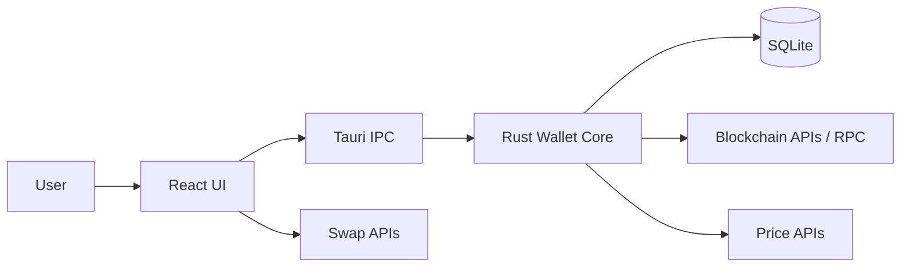
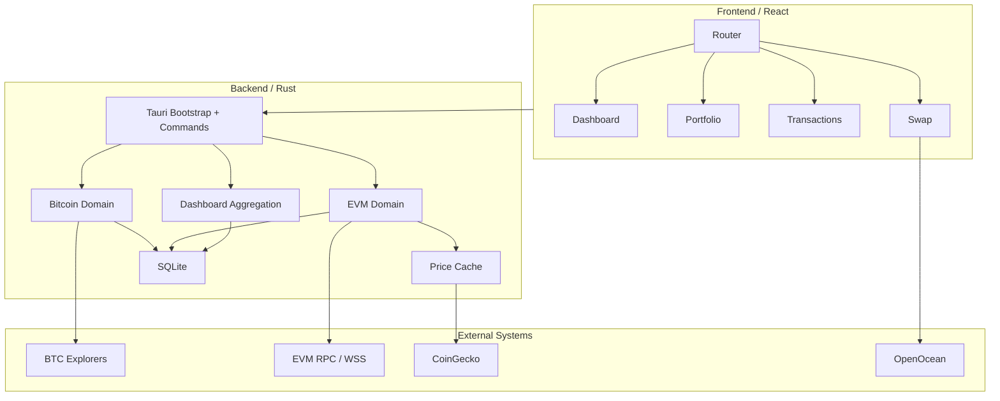
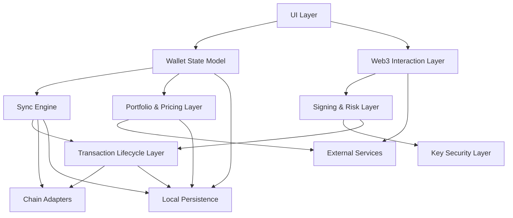

# System Overview

## Executive Summary

`aiigo-desktop` is currently a local-first desktop wallet built with Tauri, React, and TypeScript. It already supports:

- Bitcoin wallet creation, import, export, balance lookup, and transaction sending
- EVM wallet creation, import, export, multichain balance lookup, token transfer, and swap-related flows
- local portfolio aggregation and dashboard presentation

At the same time, the current implementation is still best described as an `asset wallet and portfolio application`, not yet a full `Web3 wallet`. The missing architectural layers are primarily:

- a hardened key security boundary
- a unified wallet state model and sync engine
- a Web3 interaction surface for dApp sessions and signing requests

This document explains the current architecture, the target wallet architecture, the major subsystem boundaries, and the highest-level gaps between the two.

## Product Scope And Non-Goals

### Current Scope

- Local wallet storage on the client device
- Bitcoin and EVM account management
- Balance lookup and portfolio valuation
- Basic transaction execution
- Basic swap support using external quote and allowance services

### Non-Goals For The Current Runtime

- Custodial account management
- Remote account sync as the source of truth
- Smart-account or account-abstraction orchestration
- Full Web3 wallet capabilities such as WalletConnect and EIP-1193 provider support

## System Context

At a high level, the application is a desktop client with a local Rust backend. The frontend is responsible for interaction and rendering. The backend is responsible for wallet logic, persistence, transaction execution, aggregation, and integration with external blockchain and price services.

## Current Architecture At A Glance

The current runtime is organized around a small number of concrete code modules:

- `src/pages/*` for wallet, dashboard, transaction, and swap UI
- `src-tauri/src/wallet/bitcoin/*` for Bitcoin wallet logic
- `src-tauri/src/wallet/evm/*` for EVM wallet logic
- `src-tauri/src/dashboard/*` for local portfolio aggregation
- `src-tauri/src/db.rs` for SQLite persistence

The current code-module architecture is described in more detail in [appendices/current-architecture.md](/Users/hhx/work/aiigo/aiigo-desktop/docs/architecture/appendices/current-architecture.md).

### High-Level Current Runtime Topology

## Target Wallet Architecture

The target architecture is a `full Web3 wallet` with explicit subsystem boundaries. The main change is not "more pages" but the introduction of several missing system layers: secure key handling, unified wallet state, sync orchestration, and dApp-facing interaction surfaces.

### Target System-Layer Topology

The target system-layer architecture is described in more detail in [appendices/target-architecture.md](/Users/hhx/work/aiigo/aiigo-desktop/docs/architecture/appendices/target-architecture.md).

## Core Architectural Principles

### Local-First State Ownership

The desktop client owns the local read model and local persistence. External services provide blockchain, price, and swap data, but they should not become the application's canonical product-state store.

### Clear Trust Boundaries

Secret material, signing authority, unlock sessions, export policy, and signing prompts must be treated as architecture-level concerns rather than implementation details.

### Explicit Freshness

Wallet state must be explicit about:

- what is fresh
- what is cached
- what is stale
- what is partial
- what failed to update

### Subsystem Separation By Responsibility

The wallet should separate:

- key security
- blockchain interaction
- synchronization
- valuation and aggregation
- Web3 session handling
- UI state presentation

## Subsystem Overview

### 1. Key Security Layer

Responsible for secret storage, unlock semantics, export rules, and the signing authority boundary.

### 2. Chain Adapters

Responsible for blockchain-specific read and write operations:

- Bitcoin explorer and transaction interactions
- EVM RPC and token balance lookups

### 3. Transaction Lifecycle Layer

Responsible for transaction construction, estimation, broadcast, pending state, confirmation tracking, failure handling, and replacement handling.

### 4. Sync Engine

Responsible for refreshing balances, histories, receipts, approvals, and other time-varying wallet state.

### 5. Portfolio And Pricing Layer

Responsible for asset metadata, price adapters, valuation, dashboard aggregation, and snapshot computation.

### 6. Wallet State Model

Responsible for surfacing a coherent view of balances, prices, portfolio value, freshness, transaction state, and failure scope to the UI.

### 7. Web3 Interaction Layer

Responsible for dApp sessions, account exposure, chain permissions, EIP-1193, WalletConnect, and future signing request plumbing.

## Data Ownership And Boundaries

The current implementation mixes data ownership across the wallet, dashboard, and pricing flows. The target architecture should converge on the following ownership model:

- key material belongs to the key security layer
- transaction state belongs to the transaction lifecycle layer
- freshness and user-visible truth belong to the wallet state model
- valuation belongs to the portfolio and pricing layer
- blockchain reads and writes belong to chain adapters

## Main Runtime Flows

### Wallet Creation

1. User creates or imports a wallet in the UI
2. Tauri command creates wallet metadata
3. Secret material is persisted locally
4. Wallet appears in the local read model

### Balance Refresh

1. UI requests wallet data
2. Current local state is loaded
3. External chain reads refresh balances
4. Local persistence is updated
5. Read model is updated with freshness semantics

### Transaction Send

1. User prepares a send or swap action
2. Backend estimates fee and builds transaction
3. Signing authority is invoked
4. Transaction is broadcast
5. Transaction state transitions through lifecycle updates
6. Wallet state refreshes as confirmations arrive

## Current Top-Level Gaps

From a high-level architectural perspective, the largest gaps in the current implementation are:

### Missing Hardened Key Security Boundary

The application already handles mnemonic and private-key material, but the architecture does not yet fully isolate secret storage, unlock lifecycle, export policy, and signing authority.

### Missing Unified Wallet State Model

Balances, prices, dashboard aggregates, and transaction results are refreshed through separate flows. The UI currently infers consistency instead of consuming an explicit state model.

### Missing Sync Engine

The wallet lacks a single subsystem responsible for:

- balance sync
- history sync
- receipt polling
- refresh policies
- retry and partial failure handling

### Missing Web3 Wallet Interaction Surface

The application does not yet expose:

- EIP-1193 provider behavior
- WalletConnect session handling
- typed data signing
- approval-scoped permission prompts

### Missing Unified Transaction Lifecycle Model

The system can send transactions, but it does not yet consistently model or surface:

- pending
- confirmed
- failed
- replaced
- dropped
- freshness of transaction status

## Evolution Direction

The near-term architectural direction should be:

1. preserve the current asset-wallet capabilities
2. harden secret and signing boundaries
3. unify wallet state and sync semantics
4. add explicit transaction lifecycle handling
5. add Web3 interaction surfaces only after the previous layers are stable

This sequence turns the current implementation from an asset wallet and portfolio application into a reliable Web3 wallet foundation.

## Glossary

### Local-First Wallet

A wallet whose runtime state and persistence live primarily on the client device.

### Wallet State Model

A coherent, UI-facing model of balances, transactions, prices, freshness, and failure scope.

### Freshness

Metadata that indicates how current a displayed value is and whether it was freshly synchronized, served from cache, or partially derived.

### Web3 Interaction Surface

The set of capabilities that allow external dApps to request accounts, chain access, signatures, and transaction execution from the wallet.
